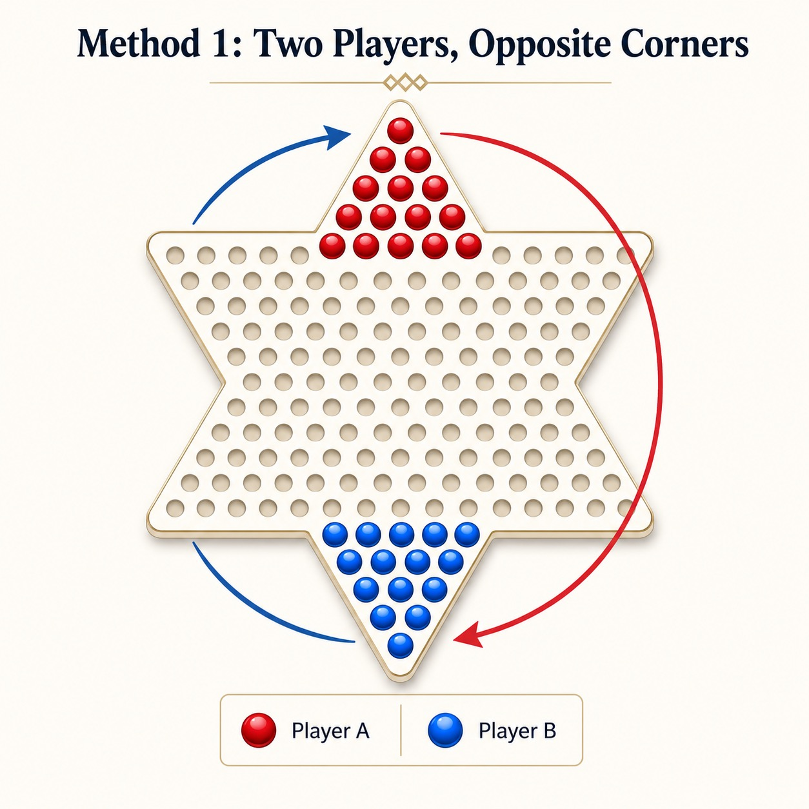
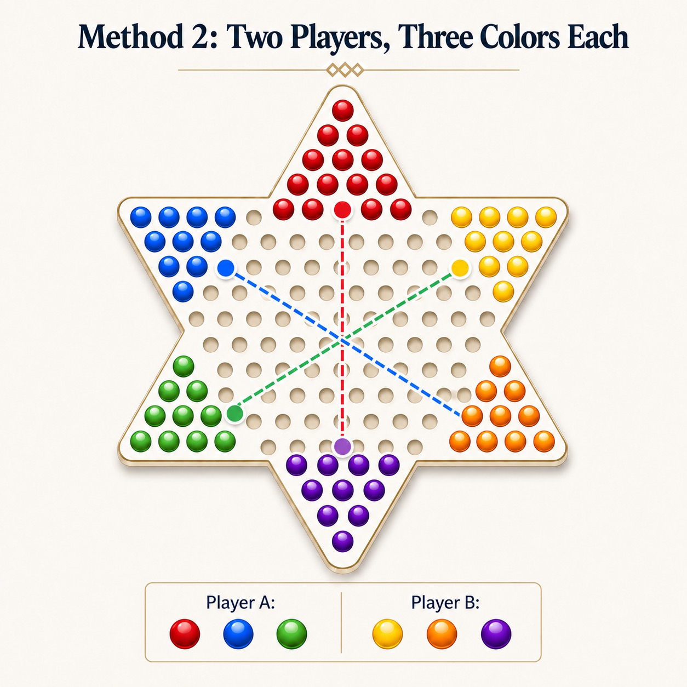
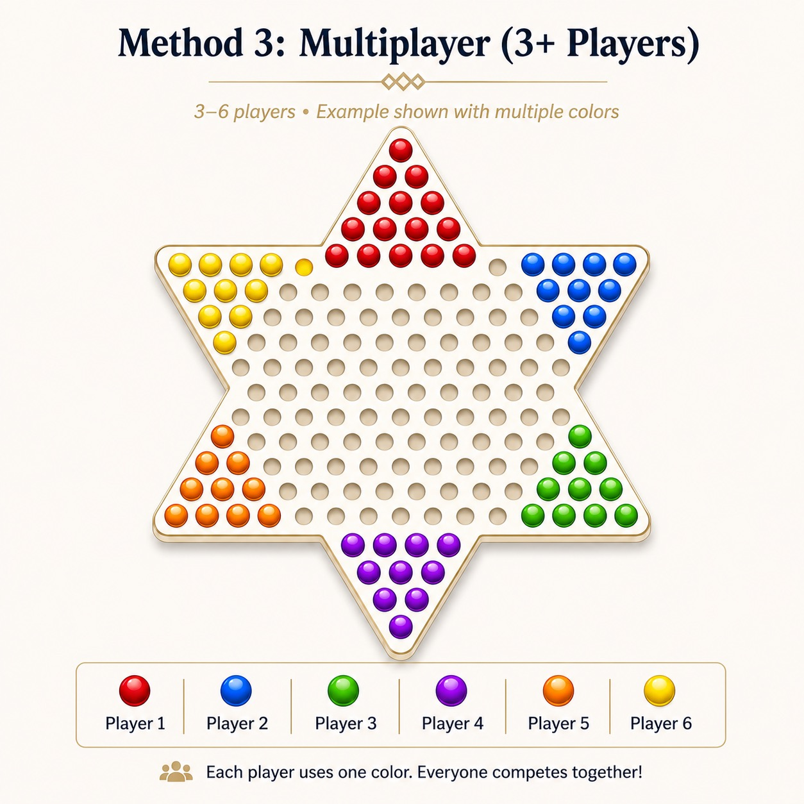

# Chinese checkers

Chinese checkers is a strategy board game for 2–6 players. The board is a six-pointed star with small holes arranged in triangular regions. Each player controls a set of colored pieces (usually marbles). The goal is to move all your pieces from your starting triangle to the opposite triangle before your opponents do. On each turn, a piece can: Move to an adjacent empty hole, or jump over another piece (your own or an opponent’s) into an empty hole. Multiple jumps can be chained in one turn.

I love playing Chinese checkers with my family when I'm young. Generally, there were three playing methods in my family:

+ Two players start from two opposite angles;
+ Two players and each of them has three colors, where each color of piece is opposite of one of the opponent's colors;
+ Three or more players compete together.

    
    
    

In this repository, I would gradually complete these three playing methods and offer a pretty UI interface. Meanwhile, I'l provide some bots with different searching algorithms. In the future, I also want to try some RL algorithms in multi-agents tasks. Coming soon ~~~
